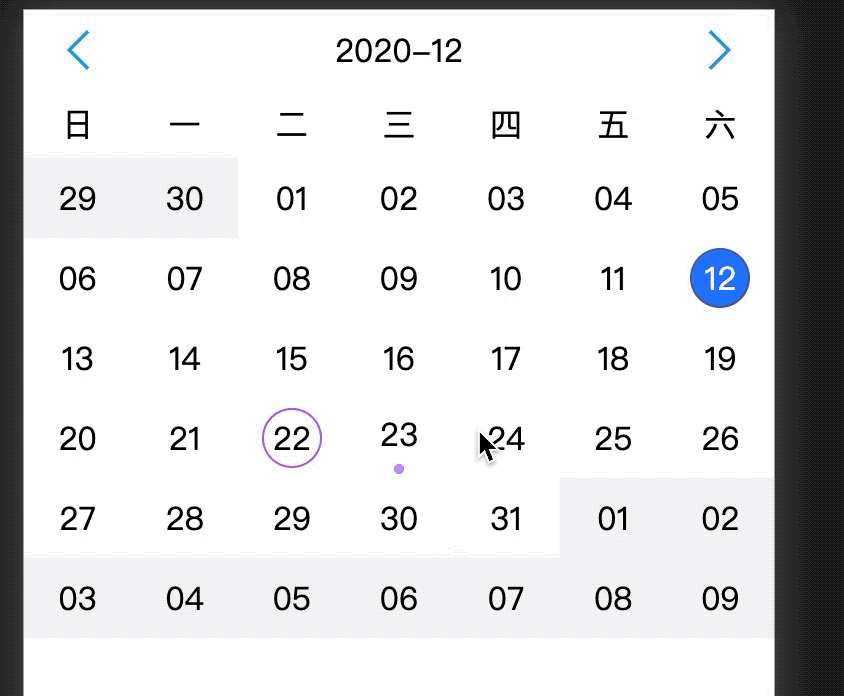
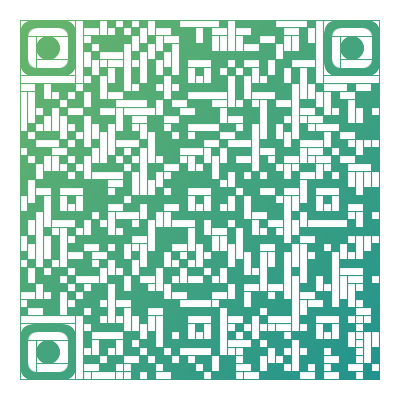

# react-h5-calendar

简体中文 | [English](https://github.com/kokiy/react-h5-calendar/blob/main/README_en.md)

###

造一个小轮子,核心文件不到三百行,一款基于 react 的移动端 , mobile, h5 日历展示组件

我这个只是精简版的日历 ,大而全的可参考 https://github.com/TangSY/react-hash-calendar

### demo



### 扫描二维码直接查看 demo



### 直接打开浏览器查看 https://kokiy.github.io/react-h5-calendar/calendar

### react 移动端日历组件

1. 支持周视图,周日历
2. 支持月视图,月日历
3. 支持左右滑动切换月份
4. 支持上下滑动切换日历视图
5. 支持日历上打点标记
6. 本项目基于[dumi](https://github.com/umijs/dumi) 构建和发布
7. 基于[dayjs](https://github.com/iamkun/dayjs)处理日历逻辑

### 使用教程

`yarn add react-h5-calendar`

```jsx
import { MobileCalendar } from 'react-h5-calendar'
export default class Demo extends Component {
  render() {
    return (
      <MobileCalendar
        onDateClick={date => this.setState({ currentDate: date.format('YYYY-MM-DD') })}
        currentDate={'2020-12-12'}
      />
    )
  }
}
```

### 参数设置

| 参数                 | 说明                            | 默认值     |
| :------------------- | :------------------------------ | :--------- |
| `currentDate`        | 当前选择的日期 比如`2020-12-12` | '当天'     |
| `showType`           | 展示类型支持`month` 和 `week`   | `month`    |
| `transitionDuration` | 切换日期的动画过渡时间          | `0.3`      |
| `onDateClick`        | 日期点击回调                    | `() => {}` |
| `onTouchStart`       | 滑动开始回调                    | `() => {}` |
| `onTouchMove`        | 滑动过程中回调                  | `() => {}` |
| `onTouchEnd`         | 滑动结束回调                    | `() => {}` |
| `markType`           | 标记类型 支持`dot`和`circle`    | `dot`      |
| `markDates`          | 需要标记的日期数组              | `[]`       |
| `disableWeekView`    | 禁用周视图                      | `false`    |

### `markDates` 参数说明

```js
const markDates = [
  { color: '#459', date: '2020-12-12', markType: 'circle' },
  { color: '#a8f', markType: 'dot', date: '2020-12-23' },
  { color: '#a5f', markType: 'circle', date: '2020-12-22' },
  { date: '2021-1-22' },
]
```

1.  单个日期不传`markType` 默认取传入的`Marktype`
2.  单个日期不传`color` 默认是`#f00`
